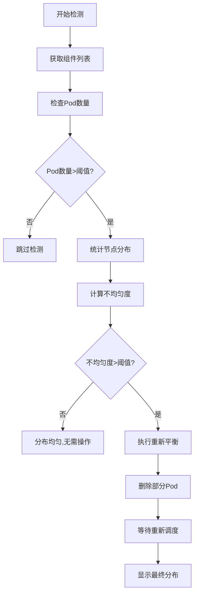

# Pod 分布均匀性检测与重新平衡 CronJob 配置指南

## 概述

这个 CronJob 功能专门用于检测 ACK 集群中 Pod 的分布均匀性，当发现 Pod 在各个节点或可用区分布不均匀时，自动删除部分 Pod 以触发 Kubernetes 重新调度，从而实现负载的均匀分布。

## 适用场景

- 🔄 **负载均衡**：确保 Pod 在各个节点上均匀分布
- 📊 **资源优化**：避免某些节点负载过高而其他节点闲置
- 🚀 **自动化运维**：定期检测和修正分布不均的问题
- 🎯 **高可用保障**：避免单点故障影响过多服务

## 功能特性

- ✅ **智能分布检测**：使用统计学方法计算分布均匀性
- ✅ **可配置阈值**：灵活设置触发重新平衡的不均匀度阈值
- ✅ **多种策略支持**：保守、平衡、激进三种重新平衡策略
- ✅ **组件级检测**：分别检测每个应用组件的分布情况
- ✅ **详细日志记录**：完整的检测和操作过程日志
- ✅ **安全可控**：最小化权限，可控的删除数量

## 工作原理

### 1. 分布均匀性计算

系统使用 **变异系数 (Coefficient of Variation)** 来衡量分布均匀性：

```
不均匀度 = 标准差 / 平均值
```

- **0.0**：完全均匀分布
- **0.1-0.2**：相对均匀
- **0.3-0.4**：轻度不均匀
- **0.5+**：严重不均匀

### 2. 检测流程



### 3. 重新平衡策略

| 策略 | 删除比例 | 适用场景 |
|-----|---------|---------|
| `conservative` | 1/4 | 生产环境，谨慎操作 |
| `balanced` | 1/3 | 大多数场景的平衡选择 |
| `aggressive` | 1/2 | 测试环境，快速重新分布 |

## 配置参数详解

### 基础配置

```yaml
rebalance:
  enabled: true                    # 启用功能
  schedule: "*/30 * * * *"         # 每30分钟检测
  strategy: "balanced"             # 重新平衡策略
  imbalanceThreshold: 0.3          # 不均匀度阈值
  minPodsPerComponent: 2           # 最小Pod数量要求
```

### 高级配置

```yaml
rebalance:
  # 等待时间控制
  waitTime: 30                     # Pod删除后等待时间
  componentWaitTime: 10            # 组件间处理间隔
  
  # 资源限制
  resources:
    limits:
      cpu: "200m"
      memory: "256Mi"
    requests:
      cpu: "100m"
      memory: "128Mi"
  
  # Job历史保留
  successfulJobsHistoryLimit: 3
  failedJobsHistoryLimit: 1
```

## 完整配置示例

### 1. 标准配置

```yaml
# values.yaml
serviceAccount:
  create: true

rebalance:
  enabled: true
  schedule: "*/30 * * * *"
  strategy: "balanced"
  imbalanceThreshold: 0.3
  minPodsPerComponent: 2
  waitTime: 30
  componentWaitTime: 10
```

### 2. 高频检测配置

```yaml
# 更频繁的检测和更敏感的阈值
rebalance:
  enabled: true
  schedule: "*/15 * * * *"          # 每15分钟
  strategy: "conservative"          # 保守策略
  imbalanceThreshold: 0.2           # 更低阈值
  minPodsPerComponent: 1
```

### 3. 低频维护配置

```yaml
# 适合稳定环境的定期维护
rebalance:
  enabled: true
  schedule: "0 2 * * *"             # 每天凌晨2点
  strategy: "aggressive"            # 激进策略
  imbalanceThreshold: 0.4           # 更高阈值
  minPodsPerComponent: 3
```

## 部署和使用

### 1. 快速部署

```bash
# 使用示例配置部署
helm upgrade --install my-demo . -f examples/rebalance-example.yaml

# 或者启用基础功能
helm upgrade --install my-demo . --set rebalance.enabled=true
```

### 2. 验证部署

```bash
# 检查 CronJob 状态
kubectl get cronjobs
kubectl describe cronjob <release-name>-rebalance

# 查看权限配置
kubectl describe role <release-name>-rebalance
kubectl describe rolebinding <release-name>-rebalance

# 检查最近的执行记录
kubectl get jobs --sort-by=.metadata.creationTimestamp | grep rebalance
```

### 3. 手动触发测试

```bash
# 手动创建测试任务
kubectl create job manual-balance-test --from=cronjob/<release-name>-rebalance

# 实时查看执行日志
kubectl logs -f -l job-name=manual-balance-test

# 查看Pod分布情况
kubectl get pods -o wide
```

## 监控和日志

### 执行日志示例

```
==================================================
🔄 Pod 分布均匀性检测与重新平衡任务开始
时间: 2024-01-15 10:30:00
==================================================
📍 操作命名空间: default
⚙️  配置参数:
   - 不均匀阈值: 0.3 (超过此值视为不均匀)
   - 最小 Pod 数量: 2 (低于此数量跳过检测)
📋 需要检查的组件: frontend gateway ads user

🔍 开始检测各组件的分布均匀性...

----------------------------------------
🔍 分析组件 frontend 的分布情况...
   📊 统计信息:
      - 总 Pod 数: 6
      - 节点数: 3
   📍 详细分布:
      按节点: node-1(3) node-2(2) node-3(1) 
      按 AZ: zone-a(3) zone-b(2) zone-c(1) 
   🎯 理想分布: 每节点 2 个 Pod
   📈 不均匀度: 0.41 (阈值: 0.3)
   ❌ 分布不均匀，需要重新平衡

🔄 执行组件 frontend 的重新平衡...
   📊 重新平衡策略: 删除 2 个 Pod (总共 6 个)
   🗑️  删除 Pod: frontend-abc123
   🗑️  删除 Pod: frontend-def456
   ✅ 已删除 2 个 Pod，等待重新调度...

----------------------------------------
🔍 分析组件 gateway 的分布情况...
   📊 统计信息:
      - 总 Pod 数: 3
      - 节点数: 3
   📍 详细分布:
      按节点: node-1(1) node-2(1) node-3(1) 
   🎯 理想分布: 每节点 1 个 Pod
   📈 不均匀度: 0.0 (阈值: 0.3)
   ✅ 分布相对均匀，无需重新平衡

==================================================
🎉 Pod 分布检测任务完成！
📊 总共重新平衡的 Pod 数量: 2
时间: 2024-01-15 10:32:15
==================================================
```

### 关键指标监控

```bash
# 监控不均匀度趋势
kubectl get events --field-selector reason=Killing | grep rebalance

# 统计各节点Pod分布
kubectl get pods -o custom-columns="NODE:.spec.nodeName" | sort | uniq -c

# 按可用区统计分布
kubectl get pods -o jsonpath='{range .items[*]}{.metadata.labels.topology\.kubernetes\.io/zone}{"\n"}{end}' | sort | uniq -c
```

## 最佳实践

### 1. 阈值设置建议

| 环境类型 | 不均匀度阈值 | 检测频率 | 策略 |
|---------|-------------|---------|------|
| 生产环境 | 0.4-0.5 | 30-60分钟 | conservative |
| 测试环境 | 0.2-0.3 | 10-15分钟 | balanced |
| 开发环境 | 0.1-0.2 | 5-10分钟 | aggressive |

### 2. 调度时间建议

```yaml
# 业务低峰期执行
schedule: "0 2 * * *"              # 每天凌晨2点

# 工作时间定期检查
schedule: "0 */2 9-17 * * 1-5"     # 工作日9-17点每2小时

# 高频监控
schedule: "*/15 * * * *"           # 每15分钟（适合关键业务）
```

### 3. 安全配置

```yaml
rebalance:
  # 限制删除比例
  strategy: "conservative"          # 最多删除1/4
  
  # 设置合理阈值
  imbalanceThreshold: 0.4          # 较高阈值避免误触发
  minPodsPerComponent: 3           # 确保有足够Pod数量
  
  # 增加等待时间
  componentWaitTime: 30           # 组件间留足时间
```

## 故障排除

### 常见问题

1. **CronJob 未执行**
   ```bash
   kubectl describe cronjob <name>-rebalance
   kubectl get events --field-selector involvedObject.name=<name>-rebalance
   ```

2. **权限不足**
   ```bash
   kubectl auth can-i delete pods --as=system:serviceaccount:default:<service-account>
   ```

3. **计算错误**
   ```bash
   # 检查bc命令是否可用
   kubectl run test --image=bitnami/kubectl:1.28 --rm -it -- /bin/sh
   echo "scale=2; sqrt(4)" | bc
   ```

4. **分布检测不准确**
   ```yaml
   # 调整检测参数
   imbalanceThreshold: 0.5        # 降低敏感度
   minPodsPerComponent: 1         # 降低最小要求
   ```

### 日志分析

```bash
# 查看最近执行日志
kubectl logs -l app.kubernetes.io/component=rebalance-job --tail=100

# 分析删除的Pod
kubectl get events --field-selector reason=Killing | grep "Killing container"

# 监控重新调度结果
kubectl get pods -w
```

## 禁用和清理

```bash
# 临时暂停
kubectl patch cronjob <release-name>-rebalance -p '{"spec":{"suspend":true}}'

# 恢复执行
kubectl patch cronjob <release-name>-rebalance -p '{"spec":{"suspend":false}}'

# 完全禁用
helm upgrade my-demo . --set rebalance.enabled=false

# 清理相关资源
kubectl delete cronjob <release-name>-rebalance
kubectl delete role <release-name>-rebalance
kubectl delete rolebinding <release-name>-rebalance
```

## 与其他系统集成

### Prometheus 监控

```yaml
# 添加监控标签
podAnnotations:
  prometheus.io/scrape: "true"
  prometheus.io/path: "/metrics"
```

### 告警配置

```yaml
# AlertManager 规则示例
- alert: PodRebalanceTooFrequent
  expr: increase(kube_job_status_succeeded{job_name=~".*rebalance.*"}[1h]) > 5
  labels:
    severity: warning
  annotations:
    summary: "Pod重新平衡过于频繁"
``` 